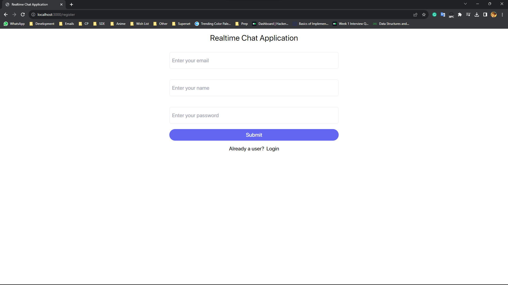
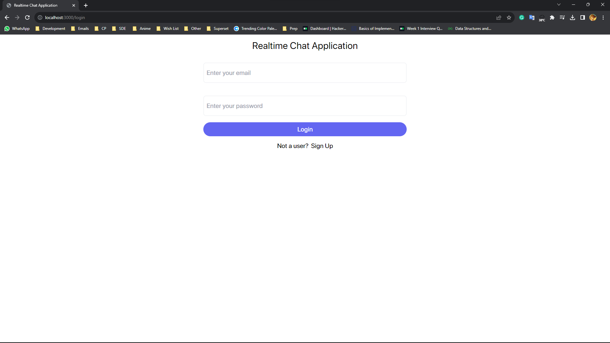
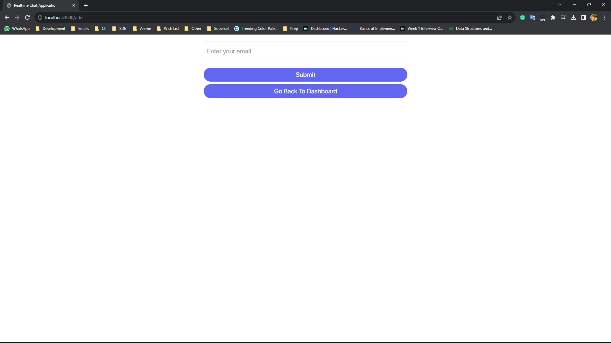
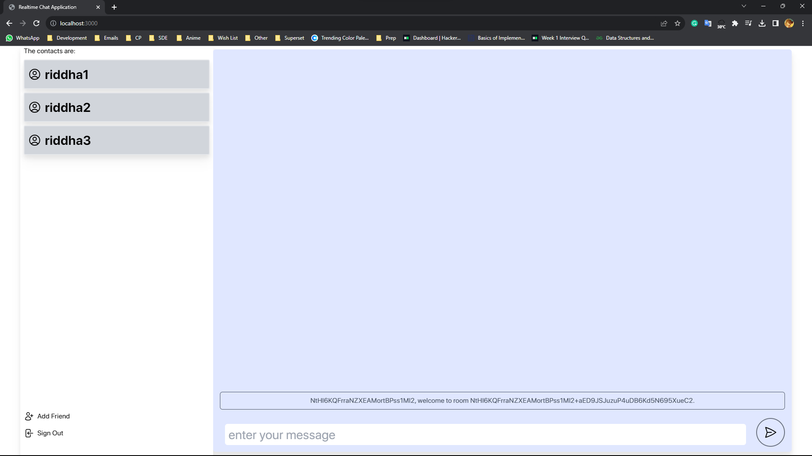

# Realtime Prototype Chat Application

This is a prototype chat application which enables users to communicate in real time. Users can register, make friends using their emails, and then chat. No records of the chats are kept. Upon completion of their chat, they can leave.

[Link To Live Website](https://br-realtime-chat-app.netlify.app)

## Guidelines for local testing

- If you are going to test the application locally by creating two users and chatting
- Open 2 instances of the applications in 2 separate browsers
- Since some state information is stored in local storage, 2 browser tabs will be unable to be separate instances.

## Examples

- Registration Screen
  
- Login Screen
  
- Adding Friend
  
- Chatting
  

## Tech Stack

- React
- TypeScript
- Firebase
- Express
